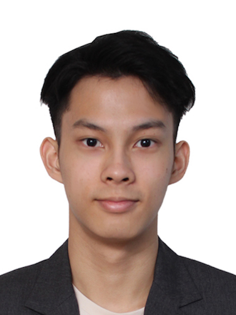
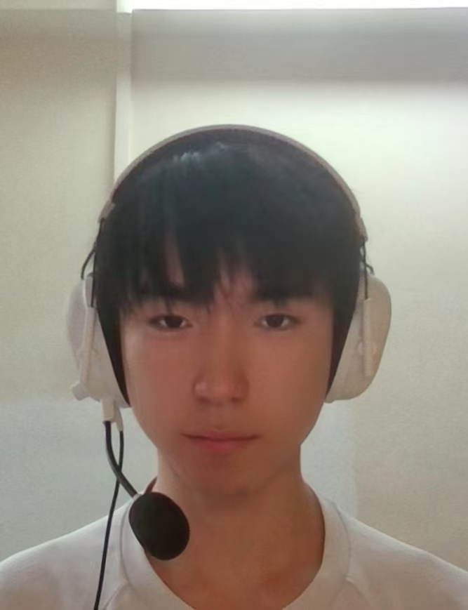
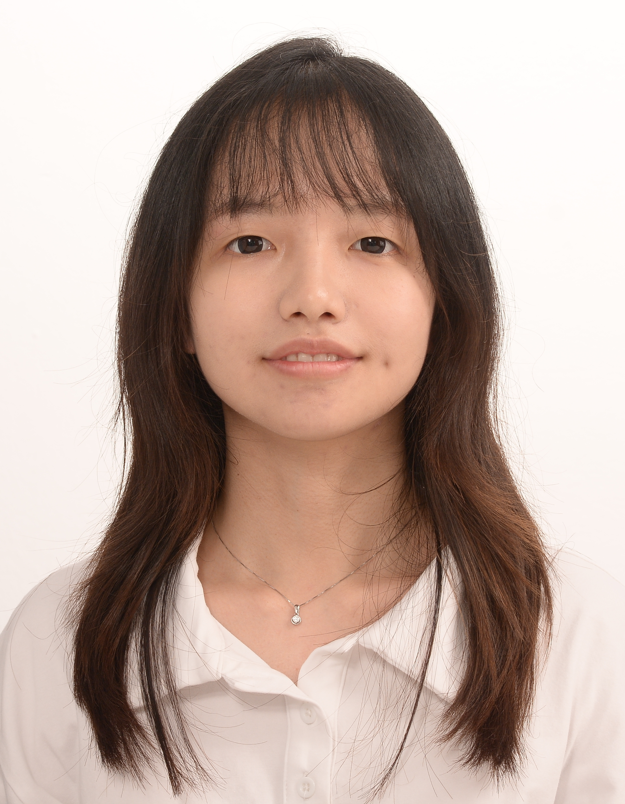
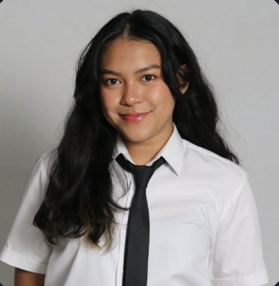

We are a team based in the [School of Computing, National University of Singapore](https://www.comp.nus.edu.sg).

You can reach us at the email `seer[at]comp.nus.edu.sg`

## Project team

### Kenji Leong

[[github](https://github.com/kkenjji)]
[[portfolio](team/kkenjji.md)]

* Role: Developer

### Harbour Wang

[[github](https://github.com/Nano-233)]
[[portfolio](team/harbour.md)]

* Role: Team Lead
* Responsibilities: UI

### Casie Lim

[[github](http://github.com/Casielim)]
[[portfolio](team/casielim.md)]

* Role: Developer
* Responsibilities: Data

### Eliza Cajetas

[[github](http://github.com/elizazaa)]
[[portfolio](team/eliza.md)]

* Role: Developer
* Responsibilities: Dev Ops + Threading

### Sulaksha Muthukrishnan

[[github](http://github.com/crmlatte)]
[[portfolio](team/crmlatte.md)]

* Role: Developer
* Responsibilities: UI
