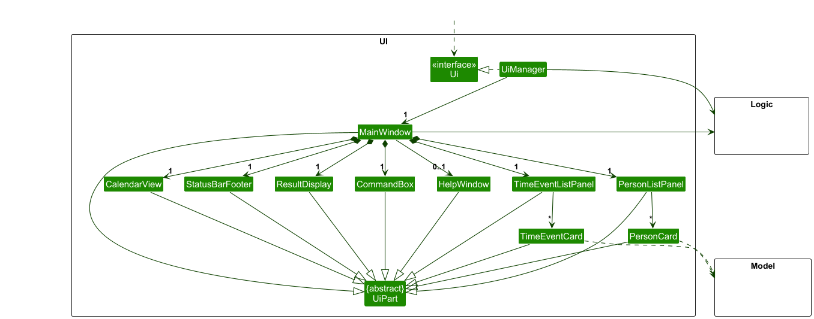
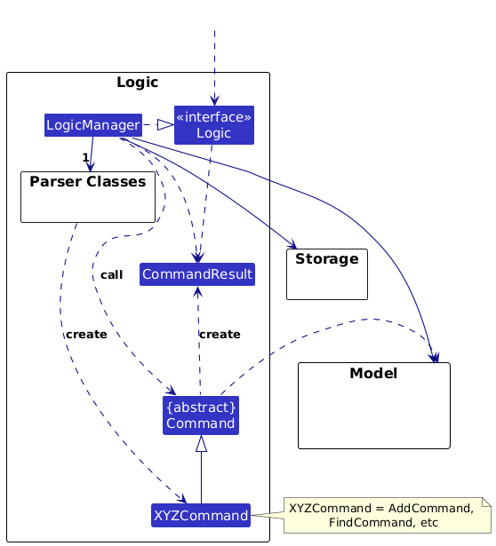
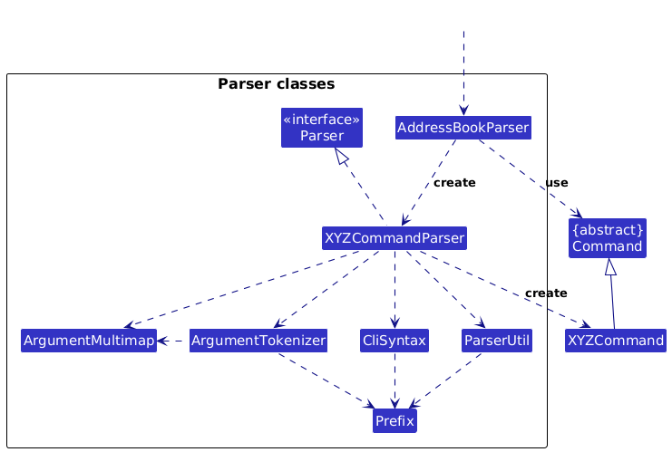
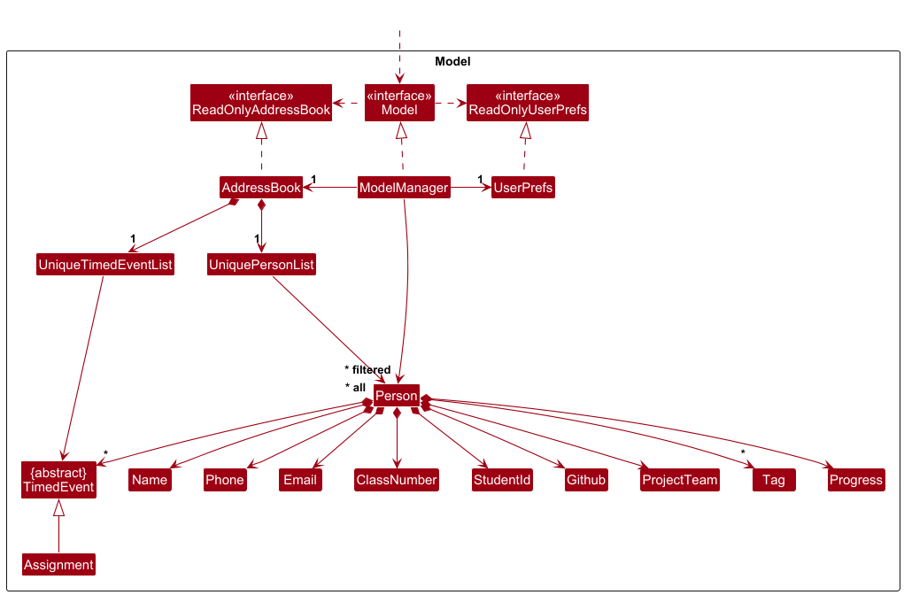
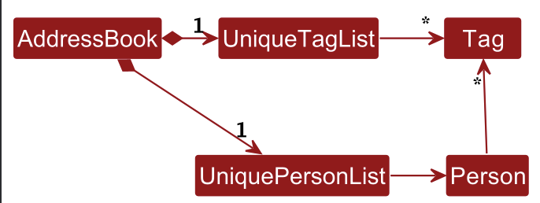

* Table of Contents
{:toc}

--------------------------------------------------------------------------------------------------------------------

## **Acknowledgements**

* This project is based on the [SE-EDU AddressBook-Level3](https://github.com/se-edu/addressbook-level3) project. Some diagrams, utility classes, and design conventions were adapted from it.
* PlantUML styling and layout tips adapted from [se-education/guides](https://se-education.org/guides/tutorials/plantUml.html).
* JavaFX components and UI structure were inspired by SE-EDU’s JavaFX tutorials.
* The GitHub repo parsing logic was inspired by open-source regex patterns from [gist.github.com](https://gist.github.com/).
* JSON storage mechanism concept inspired by SE-EDU’s Storage guide in AddressBook-Level3.

--------------------------------------------------------------------------------------------------------------------

## **Setting up, getting started**

Refer to the guide [_Setting up and getting started_](SettingUp.md).

--------------------------------------------------------------------------------------------------------------------

## **Design**

:bulb: **Tip:** The `.puml` files used to create diagrams in this document `docs/diagrams` folder. Refer to the [_PlantUML Tutorial_ at se-edu/guides](https://se-education.org/guides/tutorials/plantUml.html) to learn how to create and edit diagrams.

### Architecture

The ***Architecture Diagram*** given above explains the high-level design of the App.

Given below is a quick overview of main components and how they interact with each other.

**Main components of the architecture**

**`Main`** (consisting of classes [`Main`](https://github.com/se-edu/addressbook-level3/tree/master/src/main/java/tassist/address/Main.java) and [`MainApp`](https://github.com/se-edu/addressbook-level3/tree/master/src/main/java/tassist/address/MainApp.java)) is in charge of the app launch and shut down.
* At app launch, it initializes the other components in the correct sequence, and connects them up with each other.
* At shut down, it shuts down the other components and invokes cleanup methods where necessary.

The bulk of the app's work is done by the following four components:

* [**`UI`**](#ui-component): The UI of the App.
* [**`Logic`**](#logic-component): The command executor.
* [**`Model`**](#model-component): Holds the data of the App in memory.
* [**`Storage`**](#storage-component): Reads data from, and writes data to, the hard disk.

[**`Commons`**](#common-classes) represents a collection of classes used by multiple other components.

**How the architecture components interact with each other**

The *Sequence Diagram* below shows how the components interact with each other for the scenario where the user issues the command `delete 1`.

Each of the four main components (also shown in the diagram above),

* defines its *API* in an `interface` with the same name as the Component.
* implements its functionality using a concrete `{Component Name}Manager` class (which follows the corresponding API `interface` mentioned in the previous point.

For example, the `Logic` component defines its API in the `Logic.java` interface and implements its functionality using the `LogicManager.java` class which follows the `Logic` interface. Other components interact with a given component through its interface rather than the concrete class (reason: to prevent outside component's being coupled to the implementation of a component), as illustrated in the (partial) class diagram below.

The sections below give more details of each component.

### UI component

The **API** of this component is specified in [`Ui.java`](https://github.com/se-edu/addressbook-level3/tree/master/src/main/java/tassist/address/ui/Ui.java)

The UI consists of a `MainWindow` that is made up of parts e.g.`CommandBox`, `ResultDisplay`, `PersonListPanel`, `StatusBarFooter` etc. All these, including the `MainWindow`, inherit from the abstract `UiPart` class which captures the commonalities between classes that represent parts of the visible GUI.

The `UI` component uses the JavaFx UI framework. The layout of these UI parts are defined in matching `.fxml` files that are in the `src/main/resources/view` folder. For example, the layout of the [`MainWindow`](https://github.com/se-edu/addressbook-level3/tree/master/src/main/java/tassist/address/ui/MainWindow.java) is specified in [`MainWindow.fxml`](https://github.com/se-edu/addressbook-level3/tree/master/src/main/resources/view/MainWindow.fxml)

Specifically, it follows a component-based architecture:

* Key UI components:
  * `MainWindow` - The root container that orchestrates all UI components
  * `CommandBox` - Handles user command input
  * `PersonListPanel` - Displays the list of students
  * `TimeEventListPanel` - Shows timed events
  * `CalendarView` - Provides calendar visualization
  * `PersonCard` - Renders individual student information
  * `TimeEventCard` - Renders individual event information
  * `ResultDisplay` - Shows command execution results
  * `StatusBarFooter` - Displays application status
  * `HelpWindow` - Provides help information

The `UI` component,

* executes user commands using the `Logic` component.
* listens for changes to `Model` data so that the UI can be updated with the modified data.
* keeps a reference to the `Logic` component, because the `UI` relies on the `Logic` to execute commands.
* depends on some classes in the `Model` component, as it displays `Person` and `TimedEvent` objects residing in the `Model`.

### Logic component

**API** : [`Logic.java`](https://github.com/se-edu/addressbook-level3/tree/master/src/main/java/tassist/address/logic/Logic.java)

Here's a (partial) class diagram of the `Logic` component:

The sequence diagram below illustrates the interactions within the `Logic` component, taking `execute("delete 1")` API call as an example.

:information_source: **Note:** The lifeline for `DeleteCommandParser` should end at the destroy marker (X) but due to a limitation of PlantUML, the lifeline continues till the end of diagram.

How the `Logic` component works:

1. When `Logic` is called upon to execute a command, it is passed to an `AddressBookParser` object which in turn creates a parser that matches the command (e.g., `DeleteCommandParser`) and uses it to parse the command.
1. This results in a `Command` object (more precisely, an object of one of its subclasses e.g., `DeleteCommand`) which is executed by the `LogicManager`.
1. The command can communicate with the `Model` when it is executed (e.g. to delete a person). 
   Note that although this is shown as a single step in the diagram above (for simplicity), in the code it can take several interactions (between the command object and the `Model`) to achieve.
1. The result of the command execution is encapsulated as a `CommandResult` object which is returned back from `Logic`.

Here are the other classes in `Logic` (omitted from the class diagram above) that are used for parsing a user command:

How the parsing works:
* When called upon to parse a user command, the `AddressBookParser` class creates an `XYZCommandParser` (`XYZ` is a placeholder for the specific command name e.g., `AddCommandParser`) which uses the other classes shown above to parse the user command and create a `XYZCommand` object (e.g., `AddCommand`) which the `AddressBookParser` returns back as a `Command` object.
* All `XYZCommandParser` classes (e.g., `AddCommandParser`, `DeleteCommandParser`, ...) inherit from the `Parser` interface so that they can be treated similarly where possible e.g, during testing.

### Model component
**API** : [`Model.java`](https://github.com/se-edu/addressbook-level3/tree/master/src/main/java/tassist/address/model/Model.java)

 
Note that ***filtered** should be next to the arrow from `ModelManager` to `Person`.\
It is displayed incorrectly due to limitations of puml.

The `Model` component,

* manages the application's data through the `AddressBook` class, which contains:
  * A `UniquePersonList` for storing `Person` objects
  * A `UniqueTimedEventList` for storing `TimedEvent` objects
* stores the currently 'selected' `Person` objects (e.g., results of a search query) as a separate _filtered_ list which is exposed to outsiders as an unmodifiable `ObservableList<Person>` that can be 'observed' e.g. the UI can be bound to this list so that the UI automatically updates when the data in the list change.
* stores a `UserPref` object that represents the user's preferences. This is exposed to the outside as a `ReadOnlyUserPref` objects.
* does not depend on any of the other three components (as the `Model` represents data entities of the domain, they should make sense on their own without depending on other components)
* provides data manipulation operations:
  * CRUD operations for `Person` objects
  * CRUD operations for `TimedEvent` objects
  * Sorting operations using `Comparator<Person>` and `Comparator<TimedEvent>`
  * Filtering operations using `Predicate<Person>` and `Predicate<TimedEvent>`
* manages user preferences through:
  * `UserPrefs` for storing application settings
  * `GuiSettings` for UI-specific preferences
  * File path management for data persistence

The component follows the Observer pattern through JavaFX's `ObservableList` interface, allowing the UI to automatically update when the underlying data changes.

:information_source: **Note:** An alternative (arguably, a more OOP) model is given below. It has a `Tag` list in the `AddressBook`, which `Person` references. This allows `AddressBook` to only require one `Tag` object per unique tag, instead of each `Person` needing their own `Tag` objects. 

The rest of the Person's attributes has been abstracted out in the image above.

While the current implementation does not use this alternative model for `Tag`, it does use this approach for `TimedEvent`.\
\
The `AddressBook` maintains a `UniqueTimedEventList` which enforces uniqueness between timed events using `TimedEvent#isSameTimedEvent(TimedEvent)`.\
\
This allows the `AddressBook` to only require one `TimedEvent` object per unique event (based on name and time), rather than each `Person` needing their own copy of the same event.

### Storage component

**API** : [`Storage.java`](https://github.com/se-edu/addressbook-level3/tree/master/src/main/java/tassist/address/storage/Storage.java)

The `Storage` component,
* can save both address book data and user preference data in JSON format, and read them back into corresponding objects.
* inherits from both `AddressBookStorage` and `UserPrefStorage`, which means it can be treated as either one (if only the functionality of only one is needed).
* depends on some classes in the `Model` component (because the `Storage` component's job is to save/retrieve objects that belong to the `Model`)

### Common classes

Classes used by multiple components are in the `tassist.address.commons` package.

--------------------------------------------------------------------------------------------------------------------

## **Implementation**

This section describes some noteworthy details on how certain features are implemented.

### \[Proposed\] Undo/redo feature

#### Proposed Implementation

The proposed undo/redo mechanism is facilitated by `VersionedAddressBook`. It extends `AddressBook` with an undo/redo history, stored internally as an `addressBookStateList` and `currentStatePointer`. Additionally, it implements the following operations:

* `VersionedAddressBook#commit()` — Saves the current address book state in its history.
* `VersionedAddressBook#undo()` — Restores the previous address book state from its history.
* `VersionedAddressBook#redo()` — Restores a previously undone address book state from its history.

These operations are exposed in the `Model` interface as `Model#commitAddressBook()`, `Model#undoAddressBook()` and `Model#redoAddressBook()` respectively.

Given below is an example usage scenario and how the undo/redo mechanism behaves at each step.

Step 1. The user launches the application for the first time. The `VersionedAddressBook` will be initialized with the initial address book state, and the `currentStatePointer` pointing to that single address book state.

Step 2. The user executes `delete 5` command to delete the 5th person in the address book. The `delete` command calls `Model#commitAddressBook()`, causing the modified state of the address book after the `delete 5` command executes to be saved in the `addressBookStateList`, and the `currentStatePointer` is shifted to the newly inserted address book state.

Step 3. The user executes `add n/David …​` to add a new person. The `add` command also calls `Model#commitAddressBook()`, causing another modified address book state to be saved into the `addressBookStateList`.

:information_source: **Note:** If a command fails its execution, it will not call `Model#commitAddressBook()`, so the address book state will not be saved into the `addressBookStateList`.

Step 4. The user now decides that adding the person was a mistake, and decides to undo that action by executing the `undo` command. The `undo` command will call `Model#undoAddressBook()`, which will shift the `currentStatePointer` once to the left, pointing it to the previous address book state, and restores the address book to that state.

:information_source: **Note:** If the `currentStatePointer` is at index 0, pointing to the initial AddressBook state, then there are no previous AddressBook states to restore. The `undo` command uses `Model#canUndoAddressBook()` to check if this is the case. If so, it will return an error to the user rather
than attempting to perform the undo.

The following sequence diagram shows how an undo operation goes through the `Logic` component:

:information_source: **Note:** The lifeline for `UndoCommand` should end at the destroy marker (X) but due to a limitation of PlantUML, the lifeline reaches the end of diagram.

Similarly, how an undo operation goes through the `Model` component is shown below:

The `redo` command does the opposite — it calls `Model#redoAddressBook()`, which shifts the `currentStatePointer` once to the right, pointing to the previously undone state, and restores the address book to that state.

:information_source: **Note:** If the `currentStatePointer` is at index `addressBookStateList.size() - 1`, pointing to the latest address book state, then there are no undone AddressBook states to restore. The `redo` command uses `Model#canRedoAddressBook()` to check if this is the case. If so, it will return an error to the user rather than attempting to perform the redo.

Step 5. The user then decides to execute the command `list`. Commands that do not modify the address book, such as `list`, will usually not call `Model#commitAddressBook()`, `Model#undoAddressBook()` or `Model#redoAddressBook()`. Thus, the `addressBookStateList` remains unchanged.

Step 6. The user executes `clear`, which calls `Model#commitAddressBook()`. Since the `currentStatePointer` is not pointing at the end of the `addressBookStateList`, all address book states after the `currentStatePointer` will be purged. Reason: It no longer makes sense to redo the `add n/David …​` command. This is the behavior that most modern desktop applications follow.

The following activity diagram summarizes what happens when a user executes a new command:

#### Design considerations:

**Aspect: How undo & redo executes:**

* **Alternative 1 (current choice):** Saves the entire address book.
  * Pros: Easy to implement.
  * Cons: May have performance issues in terms of memory usage.

* **Alternative 2:** Individual command knows how to undo/redo by
  itself.
  * Pros: Will use less memory (e.g. for `delete`, just save the person being deleted).
  * Cons: We must ensure that the implementation of each individual command are correct.

_{more aspects and alternatives to be added}_

### \[Proposed\] Data archiving

_{Explain here how the data archiving feature will be implemented}_

--------------------------------------------------------------------------------------------------------------------

## **Documentation, logging, testing, configuration, dev-ops**

* [Documentation guide](Documentation.md)
* [Testing guide](Testing.md)
* [Logging guide](Logging.md)
* [Configuration guide](Configuration.md)
* [DevOps guide](DevOps.md)

--------------------------------------------------------------------------------------------------------------------

## **Appendix: Requirements**

### Product scope

**Target user profile**:

This product is for National University of Singapore's School of Computing Teaching Assistants (TA) who need to track and manage student details efficiently, the TA also:
* Prefers fast keyboard-driven interactions over mouse usage.
* Manages small groups of students.
* Needs quick access to student GitHub accounts and repositories.
* Often forgets which students require follow-ups.
* Tutors multiple classes across different courses.
* Prefer desktop apps over other types.
* Can type fast.
* Is reasonably comfortable using CLI apps.

**Value proposition**:\
Provides an easy way for Teaching Assistants to track and manage student details, such as their contact information, GitHub accounts, course progress, and project teams while enabling efficient organization and reducing administrative workload.

### User stories

Priorities: High (must have) - `* * *`, Medium (nice to have) - `* *`, Low (unlikely to have) - `*`

| Priority | As a …​           | I want to …​                                       | So that I can…​                               |
|----------|-------------------|----------------------------------------------------|-----------------------------------------------|
| `* * *`  | CS TA             | view a list of all my students                     | browse through all my students                |
| `* * *`  | CS TA             | add a student's contact details                    | store and retrieve their details              |
| `* * *`  | CS TA             | delete a student's contact entry                   | remove students I no longer teach             |
| `* * *`  | CS TA             | record my student's Github accounts                | access their project repositories             |
| `* *`    | CS TA             | open my student's Github accounts                  | browse through their repositories quickly     |
| `* *`    | CS TA             | bulk edit project team assignments                 | reorganise teams quickly                      |
| `* *`    | CS TA             | add assignment deadline                            | keep track of their submission dates          |
| `* *`    | CS TA             | assign a student to a class                        | filter students by class                      |
| `* *`    | CS TA             | assign a student to a project team                 | access students in each project team          |
| `* *`    | CS TA             | edit a student's contact details                   | update their details to be accurate           |
| `* *`    | CS TA             | search for a student by name                       | find a student easily                         |
| `* *`    | CS TA             | add Github repository links to a student           | navigate to the relevant repositories quickly |
| `* *`    | CS TA             | add progress level to each student                 | easily monitor a student's progress and skill |
| `* *`    | CS TA             | filter the students by class                       | view students within a class                  |
| `* *`    | CS TA             | filter students by progress level                  | tailor my guidance to each student            |
| `* *`    | CS TA             | filter students by project team                    | find group members of a team easily           |
| `*`      | CS TA             | assign multiple students to a project team at once | organise teams quickly                        |
| `*`      | forgetful CS TA   | set a reminder for a student tasks                 | remember to follow up                         |
| `*`      | forgetful CS TA   | schedule notification for assignment deadline      | remember to check submissions                 |
| `*`      | forgetful CS TA   | add notes to a student                             | take down important information               |
| `*`      | experienced CS TA | perform actions using keyboard commands            | work faster without a mouse                   |
| `*`      | CS TA             | add milestone achievements for students            | recognise their progress                      |
| `*`      | CS TA             | import a list of students from a CSV file          | add multiple students at once                 |
| `*`      | CS TA             | export student data as a CSV file                  | share a list of students with other TAs       |
| `*`      | CS TA             | switch between different semester views            | reference past students easily                |
| `*`      | CS TA             | see all pending reminders in one view              | ensure I do not miss any reminders            |
| `*`      | CS TA             | pin a student's contact details                    | find frequently contacted students easily     |
| `*`      | CS TA             | store multiple Github repositories per student     | access all of a student's work at once        |

### Use cases

(For all use cases below, the **System** is `TAssist` and the **Actor** is the `user (tutor)`, unless specified otherwise)

**Use case: UC1 - Add a student's contact details**

**MSS**

1. User requests to add a student.
2. User adds student's respective information.
3. System adds the student along with the information to the list of students.
4. Use case ends.

**Extensions**

* 2a. Invalid value for the input data
    * 1a1. System shows an error message.
    * Use case resumes at step 2.

* 2a. The prefix does not exist.
    * 2a1. System shows an error message.
    * Use case resumes at step 2.

**Use case: UC2 - Edit a student's contact details**

**MSS**

1. User requests to edit some details of an entry.
2. User specifies who and what to edit.
3. User enters a field and a new value to change the field to.
4. System updates the information.
5. Use case ends.

**Extensions**

* 2a. The list is empty.
  * Use case ends.

* 3a. The prefix does not exist.
  * 3a1. System shows an error message.
  * Use case resumes at step 3.

**Use case: UC3 - Add an assignment deadline**

**Preconditions: 1. An assignment is created for the students.**

**MSS**

1.  User requests to add an assignment deadline to all students.
2.  System shows a list of available assignments.
3.  User selects the assignment of interest and specifies a deadline.
4.  System set a deadline for this assignment for all students.
5.  Use case ends.

**Extensions**

* 2a. The list is empty.
  * Use case ends.

**Use case: UC4 - Add a student's GitHub account**

**MSS**

1.  User requests to add GitHub account to a student.
2.  User specifies which student to add to.
3.  System adds the GitHub account to the student.
4.  Use case ends.

**Extensions**

* 2a. The list is empty.
  * Use case ends.

**Use case: UC5 - Add assignment**

**MSS**

1.  User requests to add an assignment.
2.  System checks if the input data is a valid future date.
3.  System adds the assignment to all students.
4.  Use case ends.

**Extensions**

* 2a. The date is invalid.
    * System outputs an invalid date message.
    * Use case ends.

**Use case: UC6 - View assignment list**

**MSS**

1.  User requests to view the current assignment list.
2.  System shows the current assignment list.
3.  Use case ends.

**Use case: UC7 - Assign class to a student**

**MSS**

1.  User requests to assign a tutorial class to a student.
2.  System assigns the tutorial class number to the student.
3.  Use case ends.

**Extensions**

* 1a. The tutorial number is of invalid format.
    * System outputs an invalid class number message.
    * Use case ends.

**Use case: UC8 - Assign an assignment to one or more students**

**MSS**

1.  User requests to add an assignment to some students.
2.  System adds the assignment to all specified students.
3.  Use case ends.

**Extensions**

* 1a. The specified assignment index is invalid.
    * System outputs an invalid assignment index message.
    * Use case ends.
* 1b. The specified student index/student ID/tutorial group is invalid.
    * System outputs an error message.
    * Use case ends.

**Use case: UC9 - Add a Repository link to a Student**

**MSS**

1.  User requests to add Repository Link to a student.
2.  User specifies which student to add to.
3.  System adds the Repository Link to the student.
4.  Use case ends.

**Extensions**

* 2a. The list is empty.
    * Use case ends.

**Use case: UC10 - Delete a student's contact details**

**MSS**

1.  User requests to list students.
2.  System shows a list of students.
3.  User requests to delete a specific student in the list.
4.  System asks for confirmation.
5.  User confirms.
6.  System deletes the student from the list.
7.  Use case ends.

**Extensions**

* 2a. The list is empty.
    * Use case ends.

* 5a. User declines.
    * Use case ends.

**Use case: UC11 - List all students**

**MSS**

1. User requests to list all students.
2. System displays all students without any sorting or filtering.
3. Use case ends.

**Use case: UC12 - List students with sorting**

**MSS**

1. User requests to list students with a specific sort type and order.
2. System verifies the sort type and order.
3. System displays the students sorted accordingly.
4. Use case ends.

**Extensions**

* 2a. The sort type or order is invalid.
    * System outputs an invalid sort message.
    * Use case ends.

* 2b. Sort type is not provided but sort order is.
    * System outputs a missing sort type message.
    * Use case ends.

* 2c. Sort order is not provided but sort type is.
    * System outputs a missing sort type message.
    * Use case ends.

**Use case: UC13 - List students with filtering**

**MSS**

1. User requests to list students based on a specific filter type and filter value.
2. System verifies the filter type and filter value.
3. System displays only the students matching the filter.
4. Use case ends.

**Extensions**

* 2a. The filter type or filter value is invalid.
    * System outputs an invalid filter message.
    * Use case ends.

* 2b. Filter type is not provided but filter value is.
    * System outputs a missing filter type message.
    * Use case ends.

* 2c. Filter value is not provided but filter type is.
    * System outputs a missing filter type message.
    * Use case ends.

* 2d. No students match the filter value.
    * System displays a message indicating no matches.
    * Use case ends.

**Use case: UC14 - List students with sorting and filtering**

**MSS**

1. User requests to list students using both sorting and filtering.
2. System verifies the sort and filter parameters.
3. System filters and sorts the student list accordingly.
4. System displays the updated list.
4. Use case ends.

**Extensions**

* All the extensions from use cases <ins>list students with sorting (UC12)</ins> and <ins>list students with filtering (UC13)</ins>.

**Use case: UC15 - Importing data**

**Preconditions: 1. An external CSV file is present in the system.**

**MSS**

1. User requests to import student data.
2. System imports the student data.
3. System displays the imported data.
4. Use case ends.

**Extensions**

* 2a. The file is missing.
    * System outputs an invalid path message.
    * Use case ends.

* 3a. The file is empty.
    * System outputs a conversion error message.
    * Use case ends.

* 3b. The data is in an incorrect format.
    * System shows an empty list.
    * Use case ends.

**Use case: UC16 - Exporting data**

**MSS**

1. User requests to export student data.
2. System exports the data.
3. Use case ends.

**Extensions**

* 2a. The output file type is of invalid format.
    * System outputs an invalid file format message.
    * Use case ends.

* 2b. The output file already has data.
    * The file's data will be overwritten.
    * Use case ends.

*{More to be added}*

### Non-Functional Requirements

1.  Should work on any _mainstream OS_ as long as it has Java `17` or above installed.
2.  Should be able to hold up to 300 students without a noticeable sluggishness in performance for typical usage.
3.  A user with above average typing speed for regular English text (i.e. not code, not system admin commands) should be able to accomplish most of the tasks faster using commands than using the mouse.
4.  Should retrieve and display a student's details within 2 seconds.
5.  Should store student data locally in JSON format.
6.  System should have a simple UI that requires no more than 5 minutes of onboarding for a new TA.
7.  Should allow future expansion to handle more student attributes (e.g. assignment scores, additional contact details).
8.  Must not crash when handling unexpected input.
9.  Needs at least 80% test coverage to ensure usability.
10. Must be able to run offline without internet connection.
11. Must have a portable .jar file that can be run without installation.
12. Should use a well-documented API for future improvements.
13. Should not store any passwords such as Github passwords of student accounts.
14. Search function should return results in 1 second for queries on student names, Github, or tags.

*{More to be added}*

### Glossary

* **Mainstream OS**: Windows, Linux, Unix, MacOS
* **Private contact detail**: A contact detail that is not meant to be shared with others
* **TA (Teaching Assistant/Tutor)**: A university staff member who assists in teaching, grading,
    and managing students in a course.
* **CLI (Command Line Interface)**: A text-based interface that allows users to interact with the system
    using typed commands.

--------------------------------------------------------------------------------------------------------------------

## **Appendix: Instructions for manual testing**

Given below are instructions to test the app manually.

:information_source: **Note:** These instructions only provide a starting point for testers to work on;
testers are expected to do more *exploratory* testing.

### Launch and shutdown

1. Initial launch

   1. Download the jar file and copy into an empty folder

   2. Double-click the jar file Expected: Shows the GUI with a set of sample contacts. The window size may not be optimum.

2. Saving window preferences

   1. Resize the window to an optimum size. Move the window to a different location. Close the window.

   2. Re-launch the app by double-clicking the jar file. 
       Expected: The most recent window size and location is retained.

3. _{ more test cases …​ }_

### Deleting a person

1. Deleting a person while all persons are being shown

   1. Prerequisites: List all persons using the `list` command. Multiple persons in the list.

   2. Test case: `delete 1` 
      Expected: First contact is deleted from the list. Details of the deleted contact shown in the status message. Timestamp in the status bar is updated.

   3. Test case: `delete 0` 
      Expected: No person is deleted. Error details shown in the status message. Status bar remains the same.

   4. Other incorrect delete commands to try: `delete`, `delete x`, `...` (where x is larger than the list size) 
      Expected: Similar to previous.

2. _{ more test cases …​ }_

--------------------------------------------------------------------------------------------------------------------

## **Planned Enhancement**
1. Users must provide inputs according to the parameters specified in the User Guide. If an invalid or unrecognized parameter is used, TAssist will treat it as an error related to the previous valid parameter. 
   For example:  
   `assignment n/quiz pr/30 d/22-11-2027` 
   `assignment n/quiz ab/xx d/22-11-2027` 
   Both examples will result in an error message related to the `name` parameter: 
   "Name should only contain alphanumeric characters and spaces, and it should not be blank." 
   This is because pr/30 and ab/xx are not valid parameters for the assignment command.
   This behavior will be improved in future versions of TAssist to provide more specific error messages.

2. **When using multiple screens**, if you move the application to a secondary screen, and later switch to using only the primary screen, the GUI will open off-screen. The remedy is to delete the `preferences.json` file created by the application before running the application again.
